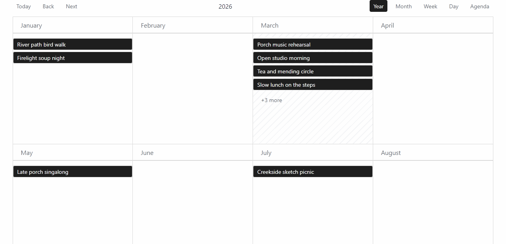
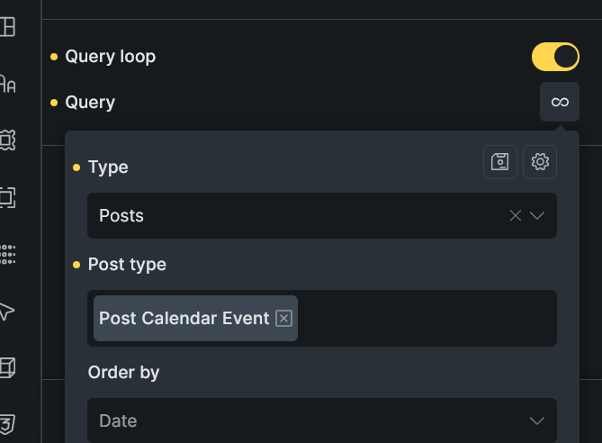

# Post Calendar

Post Calendar is a WordPress plugin that displays posts as events in a calendar via Bricks, shortcode, using [react-big-calendar](https://github.com/jquense/react-big-calendar) for the calendar UI.

## Quick start

1. [Download the plugin ZIP from GitHub Releases.](https://github.com/achtender/post-calendar/releases)
2. In WordPress admin, go to `Plugins > Add New > Upload Plugin`, upload the ZIP, and activate it.
3. In `Settings > Post Calendar`, choose which post types should show the built-in event editor.
4. Edit one of those posts and add one or more event rows in the `Post Calendar` meta box.
5. Add the calendar to a page or template with the Bricks `Post Calendar` element or the `[post_calendar]` shortcode.

## Display and query options

<table>
  <tr>
    <td align="center">
      <br>
      <strong>Year</strong>
    </td>
    <td align="center">
      <br>
      <strong>Month</strong>
    </td>
    <td align="center">
      <br>
      <strong>Week</strong>
    </td>
  </tr>
  <tr>
    <td align="center">
      <br>
      <strong>Day</strong>
    </td>
    <td align="center">
      <br>
      <strong>Agenda</strong>
    </td>
    <td>
      <br>
      <strong>Query loop</strong>
    </td>
  </tr>
</table>

## Event data model

Post Calendar stores event data on the original source post. A post becomes an event source when you save one or more event definitions in the `_post_events` meta key.

You can write that data in three ways:

- with the built-in post editor UI enabled in `Settings > Post Calendar`
- with ACF, as long as it saves the same `_post_events` meta structure
- with your own PHP code

The built-in editor writes the `_post_events` array and keeps the derived meta keys in sync, so a single post can define multiple calendar events and stay queryable.

If you update `_post_events` outside the normal post save flow, you also need to keep the derived meta keys in sync so queries stay accurate.

Derived meta keys:

- `_post_events`: event-definition array data stored on the source post
- `_post_has_events`: derived `1`/missing summary flag used for coarse event-source queries
- `_post_event_range_start`: derived earliest event-definition start on the post
- `_post_event_range_end`: derived latest bounded end on the post; it may be missing for open-ended recurring definitions

Example `_post_events` value:

```php
update_post_meta( $post_id, '_post_events', array(
  array(
    'all_day'         => 1,
    'start_date'      => '2026-03-13 00:00:00',
    'end_date'        => '2026-03-20 23:59:59',
    'repeat'          => 'none',
    'repeat_interval' => 1,
    'repeat_byday'    => array(),
    'repeat_until'    => '',
  ),
  array(
    'all_day'         => 0,
    'start_date'      => '2026-03-15 09:00:00',
    'end_date'        => '2026-03-15 11:00:00',
    'repeat'          => 'weekly',
    'repeat_interval' => 1,
    'repeat_byday'    => array( 'MO', 'WE' ),
    'repeat_until'    => '2026-06-30 23:59:59',
  ),
) );
```

Each event definition in `_post_events` uses this shape:

- `all_day`: `1` or `0`
- `start_date`: start datetime in `Y-m-d H:i:s`
- `end_date`: end datetime in `Y-m-d H:i:s`
- `repeat`: `none`, `daily`, `weekly`, `monthly`, or `yearly`
- `repeat_interval`: positive integer interval between repeats
- `repeat_byday`: array of weekday codes for weekly recurrence, such as `MO` or `WE`
- `repeat_until`: end datetime in `Y-m-d H:i:s`, or an empty string for no recurrence limit

## Shortcode

```php
[post_calendar]
```

```php
[post_calendar post_types="post,page" default_view="month" enabled_views="year,month,agenda" show_toolbar="1" agenda_range_mode="upcoming-window" agenda_range_months="12"]
```

Shortcode attributes:

- `post_types`: Comma-separated list of source post types to include for this calendar instance. Leave empty to use the post types enabled in `Settings > Post Calendar`.
- `default_view`: `month`, `week`, `day`, `agenda`, or `year`.
- `enabled_views`: Comma-separated views from `month`, `week`, `day`, `agenda`, `year`. Invalid or empty values fall back to all views.
- `show_toolbar`: `1`/`0` (also supports `true`/`false`, `yes`/`no`, `on`/`off`).
- `agenda_range_mode`: `visible-range` or `upcoming-window`.
- `agenda_range_months`: Positive integer, used for `upcoming-window`. Invalid values fall back to `3`.

## Querying events in templates and page builders

Post Calendar registers a virtual post type called `post_calendar_event`. Use it as a query target only: you do not create or edit `post_calendar_event` posts in WordPress admin. When you query it in `WP_Query` or a builder loop, the plugin resolves it to matching source posts with the derived event-source constraint applied (`_post_has_events = 1`), then expands the results into per-occurrence loop items.

### Use with a builder loop or WP_Query

Set the query post type to `post_calendar_event`. Most query options (pagination, filters, sorting) work normally. The plugin rewrites `post_type` to source types and adds the derived event-source filter. The loop renders the actual source posts, so field access, permalink, excerpt, and featured image all work without extra steps.

Recurring posts are expanded into repeated loop rows. Each row keeps the source post content, permalink, excerpt, featured image, and taxonomy data, but carries occurrence-specific event dates.

When the current loop item is an occurrence instance, the plugin exposes occurrence-specific virtual meta for that loop row:

- `get_post_meta( get_the_ID(), '_post_start_date', true )` returns the occurrence start for the current loop row
- `get_post_meta( get_the_ID(), '_post_end_date', true )` returns the occurrence end for the current loop row
- the loop post object exposes `post_calendar_occurrence_id`, `post_calendar_occurrence_start`, `post_calendar_occurrence_end`, and `post_calendar_occurrence_source_id`

For recurring queries, date constraints should be explicit whenever possible. A `meta_query` on `_post_start_date` is treated as an occurrence-range filter, and the loop paginates after recurrence expansion. If no date window is supplied, the virtual query defaults to an upcoming one-year occurrence window.

```php
$events = new WP_Query( [
    'post_type'      => 'post_calendar_event',
    'posts_per_page' => 10,
] );
```

Events are ordered by start date ascending by default. You can override it:

```php
$events = new WP_Query( [
    'post_type'      => 'post_calendar_event',
    'posts_per_page' => -1,
    'meta_key'       => '_post_start_date',
    'orderby'        => 'meta_value',
    'meta_type'      => 'DATETIME',
    'order'          => 'DESC',
] );
```

A custom `meta_query` is merged with the event-enabled constraint automatically:

```php
$events = new WP_Query( [
    'post_type'      => 'post_calendar_event',
    'posts_per_page' => 10,
    'meta_query'     => [
        [
            'key'     => '_post_start_date',
            'value'   => date( 'Y-m-d H:i:s' ),
            'compare' => '>=',
            'type'    => 'DATETIME',
        ],
    ],
] );
```

You can also pass explicit occurrence window bounds through custom query vars:

```php
$events = new WP_Query( [
  'post_type'      => 'post_calendar_event',
  'posts_per_page' => 10,
  'start'          => current_time( 'mysql' ),
  'end'            => gmdate( 'Y-m-d H:i:s', strtotime( '+90 days' ) ),
] );
```

## Developer workflow

For developing locally you can:

1. Run `npm run dev` for a watch build, or `npm run dev:preview` for a standalone React preview.
2. Run `npm run dev:admin` when working on the native post editor bundle.
3. Run `npm run build` for production assets.
4. Run `npm run build:zip` to create a release ZIP in `.release/`.
