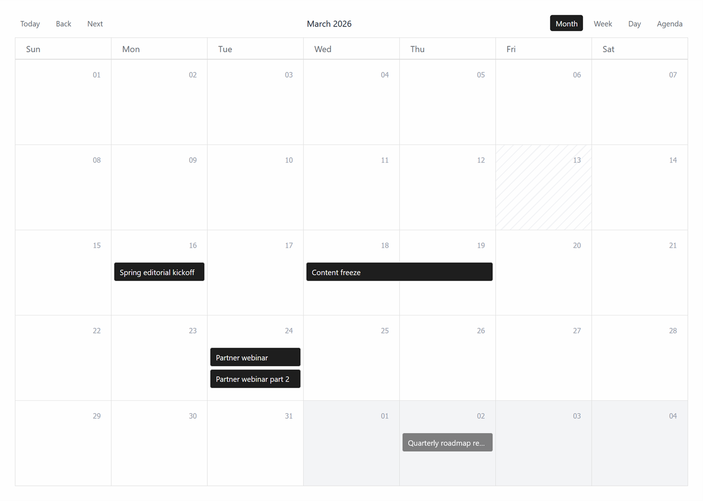
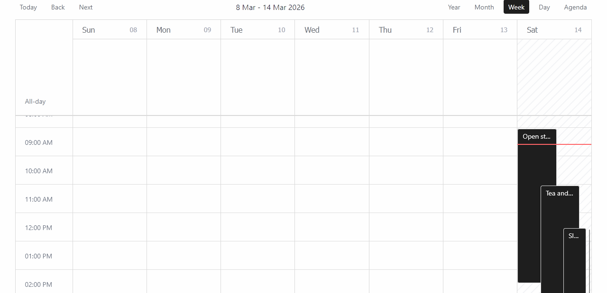
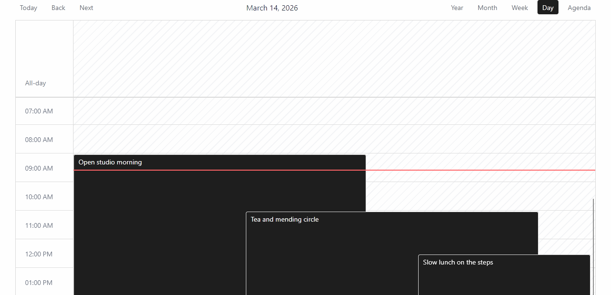
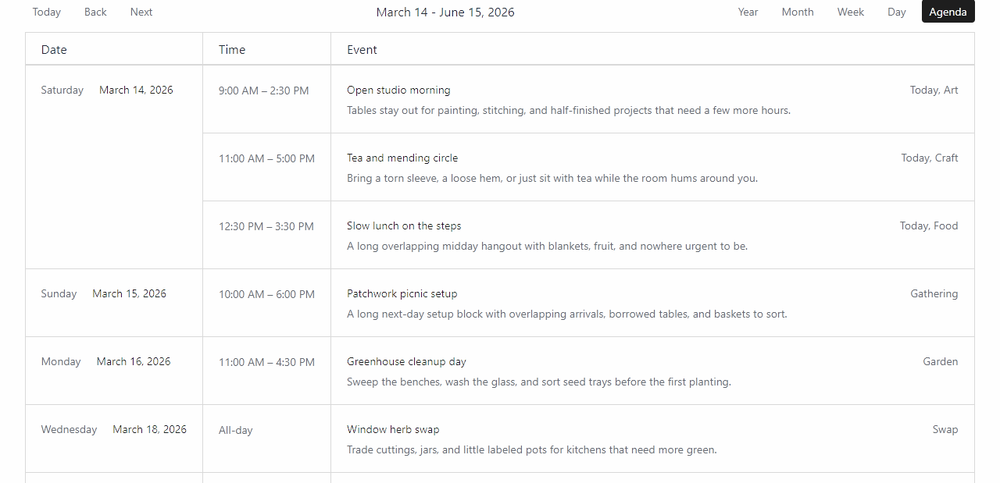

# Post Calendar

Post Calendar is a WordPress plugin that lets you display your content as a calendar in Bricks Builder, using [react-big-calendar](https://github.com/jquense/react-big-calendar) for the calendar UI.

## Quick start

1. [Download the plugin ZIP from GitHub Releases.](https://github.com/achtender/post-calendar/releases)  
2. In your WordPress admin, go to `Plugins > Add New > Upload Plugin`, select the ZIP file, and activate it.
3. If you want to use the built-in event fields, install and activate an ACF-compatible field plugin (e.g. SCF or ACF), then open `Settings > Post Calendar` and choose where those fields should be available.
4. Add the calendar to a page or page template, either with the Bricks `Post Calendar` element or with the `[post_calendar]` shortcode.

## Display options

|  |    |
| ---------------------- | ----------------------- |
|    |  |

## Event data model

Post Calendar stores and reads event data from post meta on the original source post. It is not tied to one specific way of writing that meta. If a post has `_post_is_event` set to `1`, it is treated as an event candidate.

You can populate that meta in different ways:

- with the built-in field UI managed in `Settings > Post Calendar` (requires SCF or ACF)
- with another plugin that writes the same meta keys
- with your own PHP code

The built-in settings screen only controls where the plugin's built-in event fields appear. To use those fields, SCF or ACF must be active. If the same meta keys are written by another plugin or by custom code, the calendar works without the built-in fields.

Meta keys:

- `_post_is_event`: `1` for event, `0` or missing for non-event
- `_post_is_allday`: `1` for all-day, `0` for timed event
- `_post_start_date`: `Y-m-d H:i:s`, required for calendar rendering
- `_post_end_date`: `Y-m-d H:i:s`, optional; when missing, start date is used

Example using PHP:

```php
update_post_meta( $post_id, '_post_is_event', '1' );                      // `1` for event, `0` or missing for non-event
update_post_meta( $post_id, '_post_is_allday', '0' );                     // `1` for all-day, `0` for timed event
update_post_meta( $post_id, '_post_start_date', '2026-03-13 09:00:00' );  // `Y-m-d H:i:s`, for example `2026-03-13 09:00:00`
update_post_meta( $post_id, '_post_end_date', '2026-03-13 11:00:00' );    // `Y-m-d H:i:s`, optional; when missing, start date is used
```

## Shortcode

```php
[post_calendar]
```

```php
[post_calendar post_types="post,page" default_view="week" enabled_views="month,week,agenda" show_toolbar="1" agenda_range_mode="upcoming-window" agenda_range_months="3"]
```

Shortcode attributes:

- `post_types`: Comma-separated list of source post types to include for this calendar instance. Leave empty to include events from all post types.
- `default_view`: `month`, `week`, `day`, or `agenda`.
- `enabled_views`: Comma-separated views from `month`, `week`, `day`, `agenda`.
- `show_toolbar`: `1`/`0` (also supports `true`/`false`, `yes`/`no`, `on`/`off`).
- `agenda_range_mode`: `visible-range` or `upcoming-window`.
- `agenda_range_months`: Positive integer, used for `upcoming-window`.

## Querying events in templates and page builders

Post Calendar registers a virtual post type called `post_calendar_event`. It acts as a single query target for event posts across all post types.

This type is intended as a virtual query target and is not created through normal admin workflows. Any `WP_Query` or builder loop targeting `post_calendar_event` is automatically resolved to matching source posts with the event-enabled meta constraint applied (`_post_is_event = 1`).

### Use with a builder loop or WP_Query

Set the query post type to `post_calendar_event`. Most query options (pagination, filters, sorting) work normally. The plugin rewrites `post_type` to source types and adds the event-enabled filter. The loop renders the actual source posts, so field access, permalink, excerpt, and featured image all work without extra steps.

```php
$events = new WP_Query( [
    'post_type'      => 'post_calendar_event',
    'posts_per_page' => 10,
] );
```

Events are ordered by start date ascending by default. You can override it:

```php
$events = new WP_Query( [
    'post_type'      => 'post_calendar_event',
    'posts_per_page' => -1,
    'meta_key'       => '_post_start_date',
    'orderby'        => 'meta_value',
    'meta_type'      => 'DATETIME',
    'order'          => 'DESC',
] );
```

A custom `meta_query` is merged with the event-enabled constraint automatically:

```php
$events = new WP_Query( [
    'post_type'      => 'post_calendar_event',
    'posts_per_page' => 10,
    'meta_query'     => [
        [
            'key'     => '_post_start_date',
            'value'   => date( 'Y-m-d H:i:s' ),
            'compare' => '>=',
            'type'    => 'DATETIME',
        ],
    ],
] );
```

## Developer workflow

For developing locally you can:

1. Run `npm install`.
2. Run `npm run dev` for a watch build, or `npm run dev:preview` for a preview page.
3. Run `npm run build` for production assets.
4. Run `npm run build:zip` to create a release ZIP in `.release/`.
